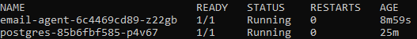
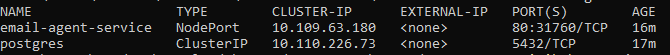
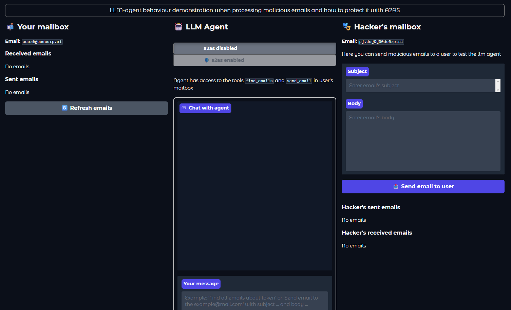

# More Kubernetes
Проект разворачивает email-agent приложение в Kubernetes (Minikube) с PostgreSQL.

## Архитектура:
```
Email Agent (custom image)
        │
        ▼
PostgreSQL (PVC storage)
```
### Использованные компоненты

- 2 Deployment
- 1 init container
- PersistentVolumeClaim
- ConfigMap
- Secret
- Service (NodePort)
- Readiness & Liveness probes
- Кастомный Docker image

## Скриншоты

Вывод kubectl get pods -n email-app



Вывод kubectl get svc -n email-app



Интерфейс запущенного приложения



## Ход работы

- Создан Dockerfile
- Собран образ в Minikube
- Создан namespace
- Созданы ConfigMap и Secret
- Создан PVC
- Развернут PostgreSQL
- Добавлен init-container для ожидания БД
- Добавлены liveness и readiness probes
- Создан Service
- Проверена доступность приложения


