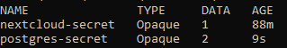
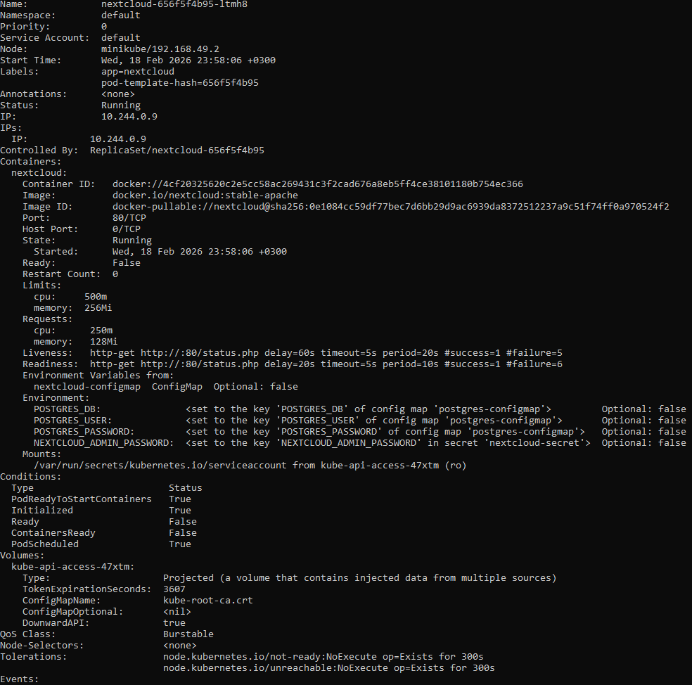

# Kubernetes
## 1. Перенос POSTGRES_USER и POSTGRES_PASSWORD в Secret


postgres-secret.yml:
```
apiVersion: v1
kind: Secret
metadata:
  name: postgres-secret
type: Opaque
stringData:
  POSTGRES_USER: "postgres"
  POSTGRES_PASSWORD: "MySacredPasswordForPostgres!"
```
Обновление postgres-deployment.yml:
```
env:
  - name: POSTGRES_USER
    valueFrom:
      secretKeyRef:
        name: postgres-secret
        key: POSTGRES_USER
  - name: POSTGRES_PASSWORD
    valueFrom:
      secretKeyRef:
        name: postgres-secret
        key: POSTGRES_PASSWORD
```

Скриншот 1 — вывод kubectl get secrets



## 2. Перенос переменных Nextcloud в ConfigMap
Создан nextcloud-configmap.yml
```
apiVersion: v1
kind: ConfigMap
metadata:
  name: nextcloud-configmap
data:
  NEXTCLOUD_UPDATE: "1"
  ALLOW_EMPTY_PASSWORD: "yes"
  POSTGRES_HOST: "postgres-service"
  NEXTCLOUD_TRUSTED_DOMAINS: "127.0.0.1"
  NEXTCLOUD_ADMIN_USER: "admin"
```
Обновлён Deployment
```
envFrom:
  - configMapRef:
      name: nextcloud-configmap
```

Скриншот 2 — kubectl describe pod nextcloud-




## 3. Добавлены Liveness и Readiness пробы
```
readinessProbe:
  httpGet:
    path: /status.php
    port: 80
  initialDelaySeconds: 20
  periodSeconds: 10
```
```
livenessProbe:
  httpGet:
    path: /status.php
    port: 80
  initialDelaySeconds: 60
  periodSeconds: 20
```
Скриншот 3 — kubectl describe pod


## Ответы на доп вопросы
### 1. Порядок применения манифестов
Вопрос: важен ли порядок выполнения манифестов? Почему?

 Да, порядок важен.

Причина:

Deployment использует ConfigMap и Secret.

Если они ещё не созданы, Pod не сможет стартовать.

Kubernetes выдаст ошибку:

CreateContainerConfigError


### 2. Что произойдет, если:

Отскейлить Postgres до 0

Затем обратно до 1

После этого попробовать зайти в Nextcloud

---
Создаётся новый контейнер, база данных пустая -> все данные Nextcloud потеряны
